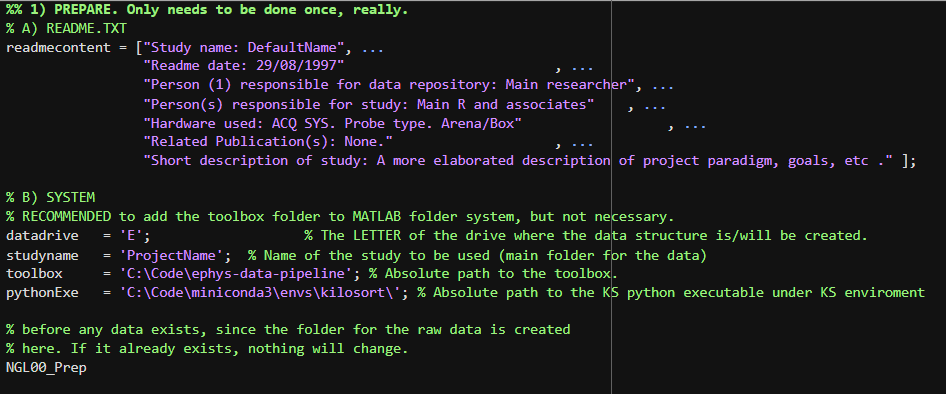
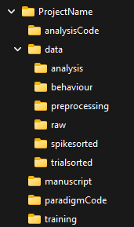
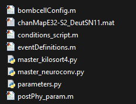
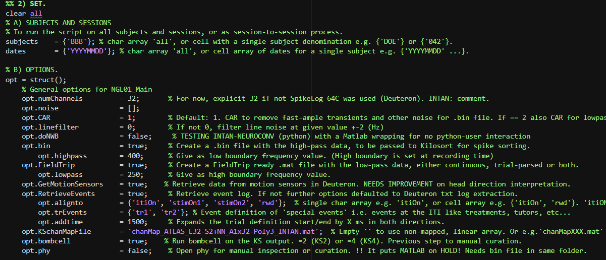
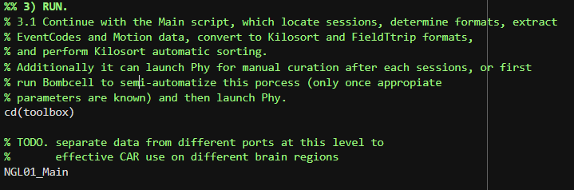

# **'Ephys-data-pipeline'**
Scripts, functions and tools to work with electrophysiological data at NGL.

# **Install The toolbox in your local PC**
For that, **clone it** (RECOMMENDED) with your choice method. Or download and unzip it, but is not so convenient.

# **Use of the Pipeline**

2 **Create a new project folder system**

For that, open **NGL_SetAndRunMe.m** inside the toolbox folder. **This only needs to be done once.**
1. Start by block **1) Prepare**: Fill up your **Readme.txt** file information.
2. Set the **data drive** for data storage, i.e. 'E'
3. Set the **name of your project**, as a word withour spaces as ProjectName or Project_Name.
4. Declare the **full path to** where your **toolbox** was cloned or downloaded, i.e. 'C:\Code\ephys-data-pipeline'
5. ONLY IMPORTANT IN **WORKSTATIONS** (Paloma, TheRevolver, etc). Declare the location of the **python executable** on the kilosort enviroment.
6. You can **run this block** of Code, so the script **NGL00_Prep.m** is called.

None of these inputs will change after this first setup.
See the image for an example:

Your data folder system should have been created now at 'datadrive':\'ProjectName'

7. Now 'Save As' your **NGL_SetAndRunMe.m** under '..\ProjectName\analysisCode'
**You will use this script** from now on, NOT the one in the toolbox.

# 3 **Start storing your raw data.**

You can drop your raw data now, with an subject/session folder system.
1. This is to be done under '..\ProjectName\data\raw' and the subforlders there will be formatted as '...\AAA\YYYYMMDD''.
2. Remember that your data SHOULD be stored as the IKN standard Harddisk data structure. 
See: gitlab.ruhr-uni-bochum.de/ikn/howto/-/wikis/Neurophysiology/hard-disk-data-structure
3. For each session, drop ONLY data/metadata files from INTAN or DEUTERON in its YYYYMMDD folder, with no subfolders or extra files.

# 4 **Copy and set all your configuration files.**

Go to the toolbox main folder and get into '..\configfiles'.
1. Copy all the files in there.
2. Paste the into your project folder '..\ProjectName\analysisCode'
3. Go over them and set your the parameters for each. Descriptions will be provided.

You should have the following files:

# 5. **Set preprocessing options.**

1. Go back to your **NGL_SetAndRunMe.m**, scroll to block **2) SET**.
2. In A) Your **subjects** and **sessions** to process can be written as 'subjects' and 'dates' cell arrays.
3. In B) Your options **('opt') structure will be set**. 

The following values set some parameters and allows to switch on/off certain parts of the pipeline.

To have appropiate spike sorting:
4. Sort out your channel maps. Once you have a .mat file ready for KiloSort
5. Drop the file it at '..\ProjectName\analysisCode' and set the name in the options

Prepare your trial structure:
6. Make sure you choose the relevant events to align data to. Not all events are supposed to be analyzed like this.
7. Set any events that inform about about changes in experimental phases, manipulation times, etc.

8. You can **run this block** of code.

#6 **RUN the preprocessing step**

1. Go back to your **NGL_SetAndRunMe.m**, scroll to block **3) Run**.
2. **Run this block**.

# Description: **'NGL01_Main'**
**'NGL01_Main.m'** will transform raw data from INTAN and Deuteron into .bin (for kilosort) and .mat (for Fieldtrip) files.
A set of options let the user to specify filters, broken channels, which sort of data to retrieve, and determine the events of interest to create our trial structures.

This Script will process high-pass data and proceed to Kilosort it with no GUI. 
Inmediately after, it will call Bombcell to 'pre-curate' and create an initial set of tags for the sorted clusters.
Then, **the user** needs to manually curate the results. There is no way around this.

For low-pass data, the downsampled time series will be stored into .mat files with the FieldTrip expected format. 
Events will be used to trial-parse the data (or let it be continous) and give proper format to allow the use of FT functions.

# Description: **'NGL02_postPhy'**
It will proceed with typical steps to transform the manually-curated spike data to NLG data format.
It will read and extract data from the python-based files into MATLAB, generating spike matices according to the lab format.
This can then be feeded into further functions to analyze, plot, etc.
It will also process the spike data to fit the FieldTrip structures together with the LFP data, and trial parsed if required.
This would allow for spike-field analysis, as well as the use of FT funtions on both domains.

# General Description. (in progress)
Pipeline process INTAN and Deuteron continous data.
Will read and process INTAN, DEUTERON (or ALLEGO) data, from selected sessions for a given animal.
The main pipeline will be: INTAN/DEUTERON raw formats to be located, then
converted to .bin files (spike sorting), and Fieldtrip .mat structures
(for LFP). Once sorted, spike data will be attached to the FieldTrip
structure. For Arena experiments, motion sensor data will be extracted and
interpreted. Data will be trial-parsed using EventCodes.

The hard disk data structure SHOULD fit the IKN standard published at:
gitlab.ruhr-uni-bochum.de/ikn/howto/-/wikis/Neurophysiology/hard-disk-data-structure

DEPENDENCIES:
Requires that all pipeline dependencies are properly located. 
I suggest to include the 'mainfolder' in Matlab's permanent path system.
The function 'set_default' will take care of the rest of folders on each run.

INPUTS:
      input.datadrive, char array with the drive where data is located. As 'D:\'
      input.studyName, char array with the project name, matching the
                         folder name where all data will be stored. As 'studyName'
      input.subjects,  char array with either 'all' OR a single subject name e.g. 'DOE'
      input.dates,     char array with either 'all' OR a cell array of dates 
                         for a SINGLE subject e.g. {'YYYYMMDD' 'yyyymmdd' ...)

OPTIONS: is a struct with many possible fields. All should have a
corresponding default inside whatever function is being called. Main ones
are:     
    opt.bin,              Creation of .bin file, input to Kilosort 2/4.
    opt.fieldtrip,           Creation of .mat file with FieldTrip format.
    opt.RetrieveEvents,   Retrieve event log from Deuteron system.
    opt.GetMotionSensors, Retrieve data from motion sensors in Deuteron.
    opt.set_filter,       If Deuteron data was adquired with a wideband.
    opt.lowpass,          Lowpass band to extract LFP from wideband.
    opt.highpass,         Highpass band to extract spike activity.

OUTPUTS:
For one single session or for a batch of sessions, from one single animal:
       Fieldtrip (.mat), binary (.bin) and/or .nwb files from
           1. Deuteron .DT2 or .DF1 data.
           2. INTAN file-per-type and file-per-channel format data.
           3. (ALLEGO data?)
       EventRecord.mat file, from Deuteron session.
       MotionData.mat file, From Deuteron sensors.
       Plots snippets of time- and frequency-domain data, from FieldTrip
       
Last modified 21.08.2025 (Jesus Ballesteros)
